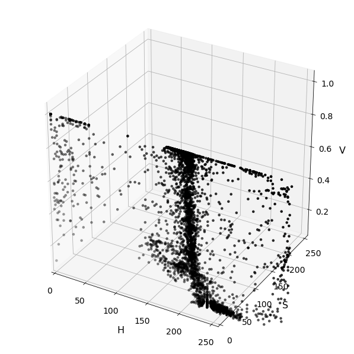

# Project 05 - Vehicle Detection and Tracking
[](http://www.udacity.com/drive)

## README
The code I used for doing this project can be found in 'Main.ipynb' file.
Also, helpers folder contains classes that are performing various functionalities.
All the cell numbers I refer to in this document is for `'Main.ipynb'. The following sections go into further detail about the specific points described in the [Rubric](https://review.udacity.com/#!/rubrics/513/view).

Project 05 - Vehicle Detection and Tracking

To run the program just run Main.ipynb on the Jupyter notebook and you can also see my results on the notebook.

All the output videos are in the output_video folder.

All the output images are in the output_images folder. 
This folder contains below mentioned images.

- 3D Spatial binning color images of different color channels HSV, HLS, YCrCb
- Color histogram of the channel YCrCb
- HOG of test2.png
- Image showing original and sliding windows.
- Image showing vehicles detected after performing sliding windows through HOG subsampling.
- Heatmap image after applying threshold.
- Result image with vehicles detected.

## Goal and Objective
---

The goals / steps of this project are the following:

* Perform a Histogram of Oriented Gradients (HOG) feature extraction on a labeled training set of images and train a classifier Linear SVM classifier.
* Apply color transform and append binned color features, to HOG feature vector. 
* Apply Historgram of colors (using YCrCb channel) and apply color histograms features to the final feature vector.
* Train a classifier to disinguish between car and non-car images.
* Implement a sliding-window technique and use your trained classifier to search for vehicles in images.
* Run vehicle detection pipeline on a video stream and create a heat map of recurring detections frame by frame to reject outliers and follow detected vehicles.
* Estimate a bounding box for vehicles detected.
---

## Model Training
---
_The jupyter notebook containing code for model training can be [found here](./Classifier.ipynb)._


###  Image Feature extractor.


Image is processed in the pipeline to extract different features that are mentioned below.

a) Spatial binning Colors features
b) Color Histogram.
c) HOG Features Detector.

All these features are concatenated to form a single feature vector of every image.


#### 1. Spatial binning Colors Features

Code can be seen [here](./helpers/utils.py) in method `bin_spatial` at line no. 23.
We convert image into a single feature vector and distribution of color pixels on the one color channel helps us in identifying whether the image is car or not. After converting image into different color channels and plotting 3d of the feature vectors, came into conclusion that HSV channel saturation layer is really helpful in classifying Cars from other objects.




Also, distribution of HSL is really intersting and that also can be used.


#### 2. Color Histogram

Compute the histogram of pixel intensities with range of 0 -256 and 32 bins. Distributes intensities of pixels in bins.
Code can be seen [here](./helpers/utils.py) in method `color_hist` at line no. 46.

#### 3.  HOG features

The code for HOG feature extraction can be found in `./helpers/utils.py` in `get_hog_features` at line no. 30. 

HOG computes the gradients of every pixel and then computes histogram with gradients. Weight of every pixel is decided by the magnitude of the gradient.
These weights decide how pixel gradient value will be distributed in histogram bins.


I then explored different color spaces and different `skimage.hog()` parameters (`orientations`, `pixels_per_cell`, and `cells_per_block`).  I grabbed random images from each of the two classes and displayed them to get a feel for what the `skimage.hog()` output looks like.

Here is an example using the `YCrCb` color space and HOG parameters of `orientations=8`, `pixels_per_cell=(8, 8)` and `cells_per_block=(2, 2)`:


### Feature Extraction for Model

I tried various combinations of color spaces, orient, hist_bins and other before finally settling with following:

```
color_space = 'YCrCb'
spatial_size = (32, 32)
hist_bins = 128
orient = 12
pix_per_cell = 8
cell_per_block = 4
scale = 1.8
y_start = 400
y_stop = 656
hog_channel = 'ALL'
spatial_feat = True
hist_feat = True
hog_feat = True
```

The `color_space` was decided by training a classifier on different color spaces for spatial features, and `YCrCb` with HOG performed better than `RGB`, `HLS`, and `HSV`.

The `hist_bins` various values are tried from 32, 64 and 128 and 128 provided better precision and recall on the test set.

Increasing `orient` and `cell_per_block` also helped in providing better accuracy, precision.

### Data Augmentation and Train-Test Split 

The `train_test_split` from `sklearn.model_selection` was used to randomized the data and make a 80-20% train-test split. The split was made so as to keep the ratio of vehicles and non-vehicles similar.

### Model Training

The extracted features where fed to `LinearSVC` model of `sklearn` with default setting of `square-hinged` loss function and `l2` normalization. The trained model had accuracy of `99.00%`, precision of `100.00%` and recall of `99.00%` on test dataset.

SVC Linear classifier is decided after trying various classifiers and found that Linear SVC has high precision and recall.

The trained model along with the parameters used for training were written to a `svcClassifier.pkl` file to be further used by vehicle detection pipeline.

** _Model training code can be [found here](./Classifier.ipynb)._ **

## Vehicle Detection Pipeline
---


### 1. Sliding Window Search
A single function, `find_cars` in `./helpers/vehicleDetector.py`, is used to extract features using hog sub-sampling and make predictions. The hog sub-sampling helps to reduce calculation time for finding HOG features and thus provided higher throughput rate.
Sample images of Sliding Window and a sample output from the same is shown below.

Sliding Window :


HOG Subsampling Output :


Code with multi-scale window search and heatmap to reduce false positives have been implemented in the class `FilterFalsePositive` in `./helpers/filterFalsePositive.py` and is discussed in upcoming sections.

### 2. Avoiding False Positives and Label Detection

####  Heatmaps and Label Detection
I recorded the positions of positive detections in each frame of the video.  From the positive detections I created a heatmap and then thresholded that map to identify vehicle positions.  I then used `scipy.ndimage.measurements.label()` to identify individual blobs in the heatmap.  I then assumed each blob corresponded to a vehicle.  I constructed bounding boxes to cover the area of each blob detected. 

I have also calculated heatmaps ouput for 3 image frames. I have used queue to store last 3 image frames and combined them to add more heats around the blobs of cars. It helped in keeping the heat blobs always over the car in the video. Also, as per my intuition it helped in removing the false positives as I have increased the threshold to 5.


## Video Implementation
---

### 1. Vehicle Detection


**Project video output**

This video can be found at:  [project_video_output.mp4](./output_video/project_video_output.mp4)


**Simulateous Vehicle and Lane Detection**

Opional implementation of simultaneous vechicle and lane detection can be accessed by clicking the [project_video_lane_vehicle.mp4](./output_video/project_video_lane_vehicle.mp4)
The code for the same can be accessed [here](./VehicleAndLaneDetection.ipynb).

**Test video output**

This video can be found at:  [test_video_output.mp4](./output_video/test_video_output.mp4)

### Improvements

1) Have to implement Multi scale window approach on the image frames so that it can identify near cars and cars far away also.

2) Hard data mining is required to remove unwanted false positives, sometimes you will observe it is showing rectangle on the cars coming from the opposite side.

3) More data is required so that it can detect cars of different sizes and shapes.

4) Car label Rectangle in the ouput video is not smooth as it should be. Have to figure out a way to average the rectangle positions.
